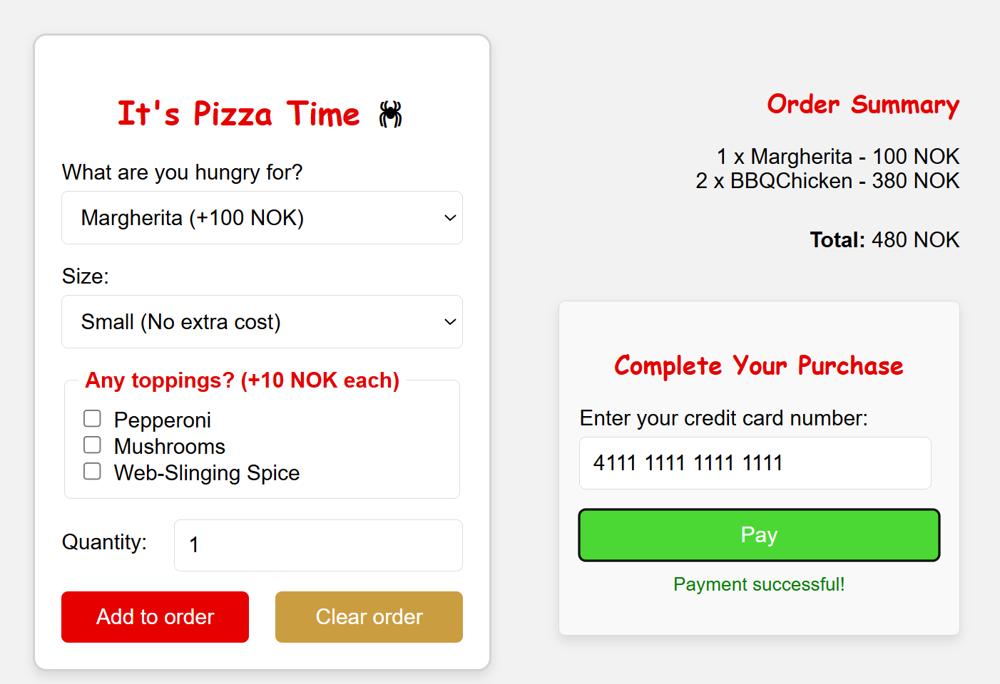
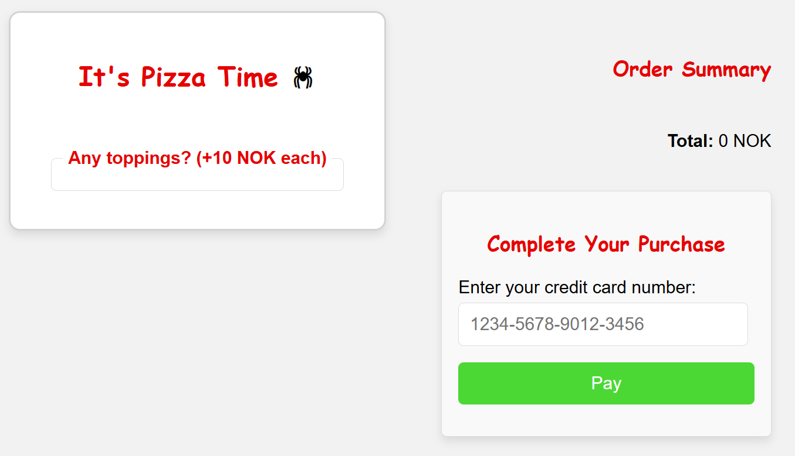
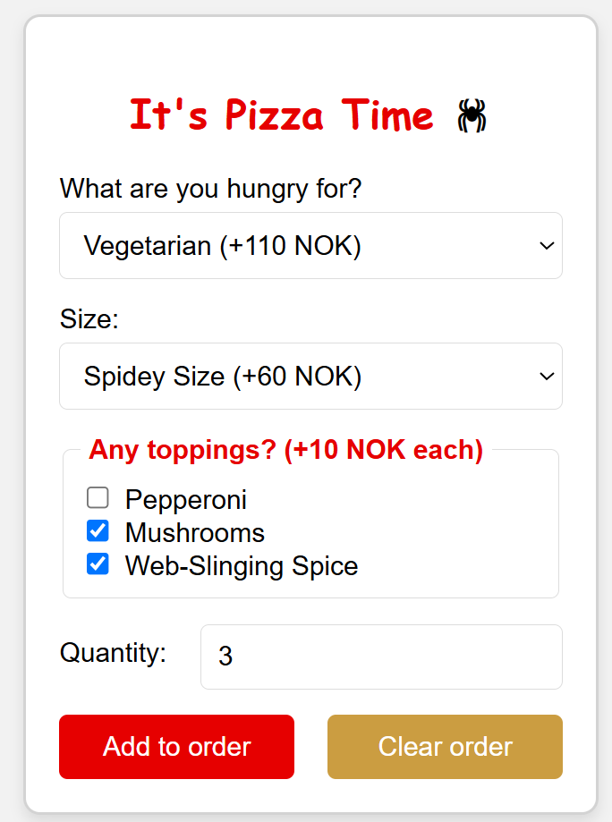
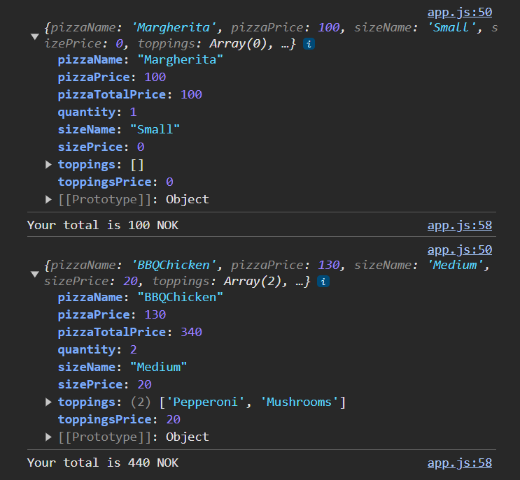
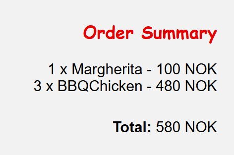
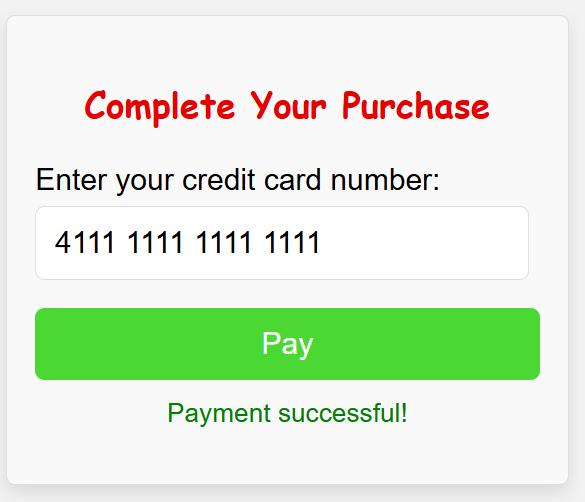
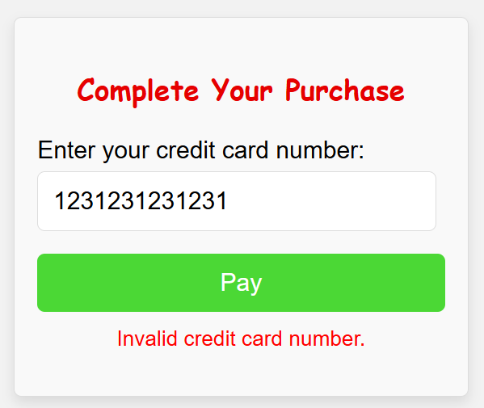

# Pizza order activity

> First make a fork of this repository. You wont be able to make changes to this remote repository.

This activity is to test all what we have learnt so far at once in a single project that is based in a real world scenario. 

In this activity, you are going to make a pizza order form that allows multiple pizzas to be added, one by one, to an order. This order is then shown as a summary on the side with a cost breakdown. Finally, there is a field to input a credit card and 'pay' for the order.

**NOTE**: We are not going to integrate with a payment service, but rather validate the card number and create a single large object to represent our entire order as JSON and log it. Below is an example what the UI could look like.



You will get this starting UI to build on:



The instructions below are broken into tasks which can act as checkmarks for you - this helps you gauge your own knowledge of the topics we have covered so far.

## Starting point

Once you have forked this repository, `clone` it to your computer, make a branch called `dev` where you will add all the code for the activity.

Each task could be a way to scope commits, i.e. `feat(task1): added pizza form design`.

**NOTE**: your commit messages should be readable and clear, a good template to use is `type(scope): details`.

Type could be: `fix`, `chore`, `feat`, `refactor`, or any others that are clear.
Scope could just be which task is this relating to, as we dont have many files in this project.

You will be given the basic HTML skeleton to perform the various tasks as well as some basic CSS and linked source files.

When you have completed all the tasks for the activity, `merge` your code back into `main` by doing a pull request (on GitHub or in VSCode, whichever works best for you). Then you can continue with refactoring branches, or even additional feature branches (like a dark mode button) if you wish.

**Important!** When doing any DOM manipulation, decide on which DOM approach (jQuery/DOM API) you want to do on your `main` branch, finish the activity. Then come back, make a refactoring branch, and make commits for each section until you have refactored all the tasks tagged with *DOM* to the other approach. It is recommended to do it with *jQuery* first as we havn't covered as much on forms with jQuery as with traditional DOM.

## Task 1: Build a Pizza Order Form and Log Totals

**Tags**: Forms, DOM, Flexbox, CSS, Loops, Objects, Arrays

For this you will need two global variables to keep track of all the `orderPizzas` in an array and the `orderTotal` to represent the total cost.

#### **Create the Pizza Order Form**
- **Pizza Type**: Create a `<select>` dropdown with the following options:
  - `Margherita (+100 NOK)` with value `Margherita-100`
  - `Pepperoni (+120 NOK)` with value `Pepperoni-120`
  - `BBQ Chicken (+130 NOK)` with value `BBQChicken-130`
  - `Vegetarian (+110 NOK)` with value `Vegetarian-110`
  - `Friendly Neighborhood Special (+140 NOK)` with value `FriendlySpecial-140`

- **Pizza Size**: Create another `<select>` dropdown with options:
  - `Small (No extra cost)` with value `Small-0`
  - `Medium (+20 NOK)` with value `Medium-20`
  - `Large (+40 NOK)` with value `Large-40`
  - `Spidey Size (+60 NOK)` with value `SpideySize-60`

- **Toppings**: Add three checkboxes:
  - `Pepperoni (+10 NOK)` with value `Pepperoni-10`
  - `Mushrooms (+10 NOK)` with value `Mushrooms-10`
  - `Web-Slinging Spice (+10 NOK)` with value `WebSlingingSpice-10`

- **Quantity**: Add an `<input type="number">` to capture the number of pizzas, with a default value of `1`.
- **Submit and clear buttons**: Add two buttons, one to `submit` the form, the other to `reset` it. HINT: `type` attribute.

An example of what this could look like is shown below:



#### **Extract Form Values**
- Register and create an event handler to trigger your JS code when the form is submitted.
- **Prevent Form Submission**: Use `event.preventDefault()` in your form's `submit` event handler to stop the form from submitting and refreshing the page.
  
- **Pizza Type and Price**:
  - Extract the value of the selected pizza. HINT: Use `split('-')` and `parseInt()` to separate the cost out and add it to the pizza total. 

- **Pizza Size and Price**:
  - Capture the selected size from the size dropdown in a similar way to the pizza type. Again, you'll need to split the value to get both the size name and the additional price.

- **Toppings**:
  - Find all the checked toppings. (HINT: Use `'input[name="topping"]:checked'` to target the checked boxes).
  - Loop through each checked topping, extract its value, split it, and store the topping names and their prices in an array and a running total.

- **Quantity**: Capture the value from the quantity input. Don’t forget to convert it into a number.

#### **Calculate the Pizza's Total**
- Add up the price of the pizza, the size, and any toppings.
- Multiply the sum by the quantity to get the total price for this pizza order.

#### **Store the Pizza Order**
- Create an object to represent the pizza order:
  - `pizzaName` 
  - `pizzaPrice` 
  - `size` 
  - `sizePrice` 
  - `toppings`
  - `toppingsPrice`
  - `quantity`
  - `pizzaTotalPrice`
- Push this object into your `orderPizzas` array.

#### **Update and Log the Order Total**
- Keep track of the total cost for all pizzas in an `orderTotal` global variable.
- Add the current pizza's total to `orderTotal` and log it to the console.

An exmaple of these logs can be seen below:



## Task 2: Create an Order Summary

**Tags**: DOM, Arrays, Objects, Loops

#### **Reset the Form After Submission**
- **Reset the Form**: After adding a pizza to the order, the form should be reset to its default values. **HINT**: Use `this.reset();` in the form submit handler.

#### **Update the Order Summary**
- Create a function called `updateOrderSummary` which does the following:
  - Use a loop to iterate over the `orderPizzas` array and generate the HTML for the order summary.
  - For each `pizzaOrder`, display the **quantity**, **pizza name**, and **total price** (e.g., `2 x Margherita - 200 NOK`). **HINT**: Append each pizza order to the `order-list` `<ul>` list in the HTML.
  - After adding all the pizza orders, display the `orderTotal` price in the `order-total` `<span>` in the HTML.

An sample of this is shown below:



## Task 3: Payment and Credit Card Validation with JSON Order

**Tags**: Forms, Validation, DOM, Luhn Algorithm, JSON

In this task, you will use a payment panel where users can input their credit card details, validate the card using the **Luhn algorithm**, and then log the order as a **JSON object**. This object will include the pizza orders, total price, and credit card number.

**Optional extra**: Add the users location when they are validated and can pay. This can be done using `navigator.geolocation.getCurrentPosition`. Add this to the final JSON object that is logged.

### **Validate the Credit Card Using the Luhn Algorithm**

- You need to create a function to validate the entered credit card number using the **Luhn algorithm**. 
- When the user clicks the pay button, the value from the credit card input should be captured and cleaned (i.e., remove any non-numeric characters such as spaces or dashes). This cleaned number should then be passed to the Luhn algorithm function for validation.
- The [Luhn algorithm](https://en.wikipedia.org/wiki/Luhn_algorithm) works by iterating over the card number from right to left, doubling every second digit, and adding the digits together. 
    - If the total sum is divisible by 10, the card number is valid.
- **OPTION**: If you are struggling with the Luhn algorithm, simply validate if the `credit-card` input is not empty, then print the *validation feedback* detailed below.
- **Validation Feedback**: After validating the credit card number:
  - If the card is valid, display a success message (e.g., "Payment successful!") in the `payment-method` paragraph tag with green text and log the order
  - If the card is invalid, display an error message (e.g., "Invalid credit card number.") in the same paragraph tag but with red text.

Below are two samples, one for each vaildation state:





Some valid credit card numbers you can pick from:

**Visa**
- `4111 1111 1111 1111`
- `4012 8888 8888 1881`

**MasterCard**
- `5555 5555 5555 4444`
- `5105 1051 0510 5100`

**American Express (AMEX)**
- `3782 822463 10005`
- `3714 496353 98431`

### **Log the Order in a JSON Object**

- Once the payment is successful, create a JSON object that includes:
  - The `orderPizzas` array (which stores all the pizzas the user ordered).
  - The `orderTotal` variable (which stores the total cost of the order).
  - Optionally: the user's browser location, which can be retrieved using the **Geolocation API**. This will provide both the latitude and longitude of the user.
  - The credit card number (for the sake of demonstration in this task, though remember in real applications, credit card numbers should **never** be logged or sent like this).

Below is a sample JSON object for an order. NOTE: this will be logged in Dev Tools, its shown here like this for formatting purposes.

```json
{
    "pizzas": [
        {
            "pizzaName": "Margherita",
            "pizzaPrice": 100,
            "sizeName": "Small",
            "sizePrice": 0,
            "toppings": [],
            "toppingsPrice": 0,
            "quantity": 1,
            "pizzaTotalPrice": 100
        },
        {
            "pizzaName": "BBQChicken",
            "pizzaPrice": 130,
            "sizeName": "Medium",
            "sizePrice": 20,
            "toppings": [
                "Pepperoni",
                "Mushrooms"
            ],
            "toppingsPrice": 20,
            "quantity": 2,
            "pizzaTotalPrice": 340
        }
    ],
    "total": 440,
    "cardNumber": "4111111111111111"
}
```

## Lykke til

